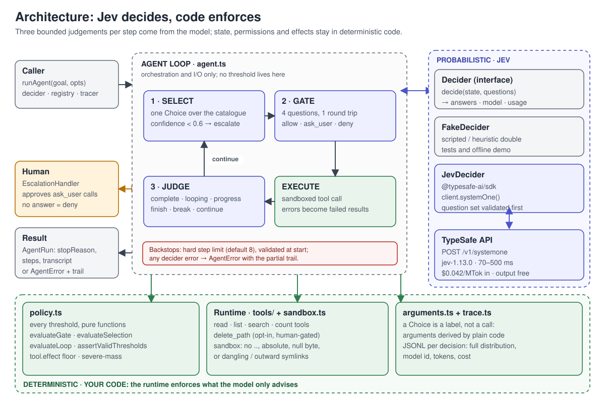
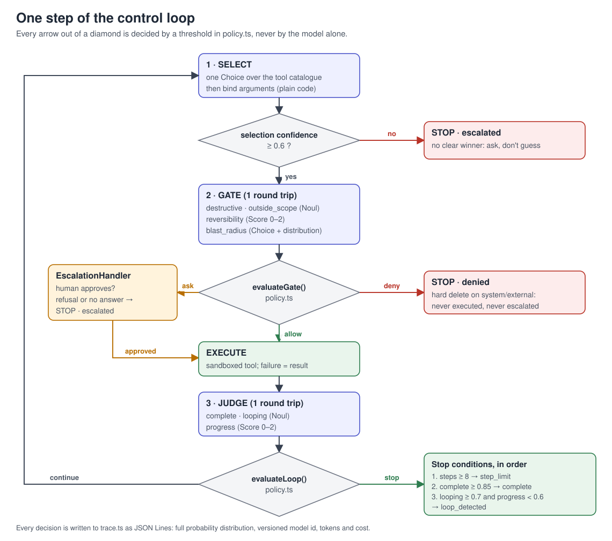
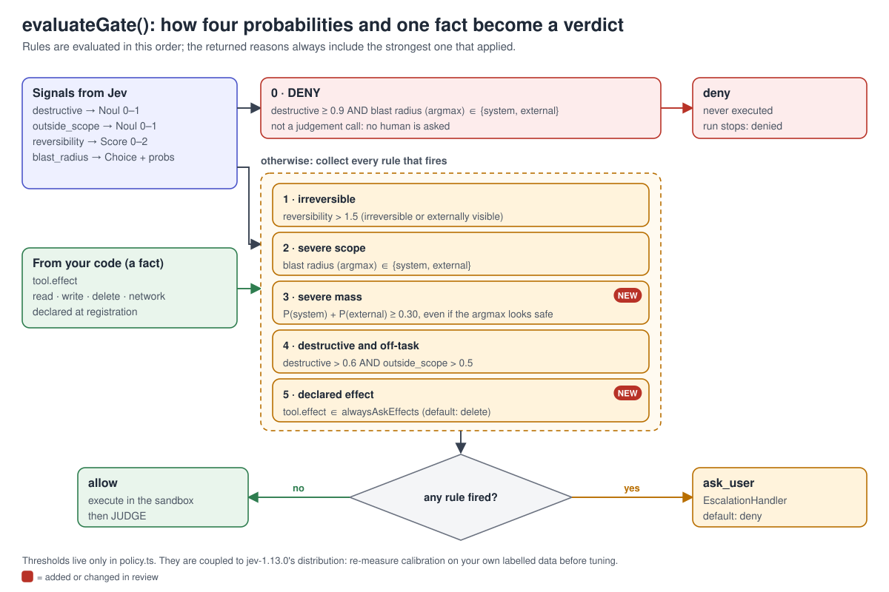

# Architecture

## The problem this shape solves

An agent that calls tools needs three judgements on every step: which tool fits, whether the
resulting call is safe, and whether the goal is already met. Those are small, bounded,
high-frequency questions sitting in the hot path — the exact shape a System One model is built
for, and the worst shape for a text-generating LLM, where every one of them costs a parse.

This harness puts Jev in the control layer and leaves everything else to code.



## Layers

```
┌──────────────────────────────────────────────────────────────────┐
│ agent.ts            loop: select → gate → execute → judge        │
├──────────────────────────────────────────────────────────────────┤
│ policy.ts           every threshold, as pure functions          │
│ decider/            Decider interface + questionsets + adapters  │
│ tools/, sandbox.ts  effects, and the boundary they cannot cross  │
│ arguments.ts        deterministic argument derivation           │
│ trace.ts            JSONL forensics, cost accounting             │
└──────────────────────────────────────────────────────────────────┘
```

## Decision 1 — our own `Decider` interface

```ts
interface Decider {
  decide(request: DecideRequest): Promise<DecideResult>;
  readonly source: string;
}
```

`JevDecider` is a thin pass-through to `client.systemOne()`. `FakeDecider` implements the same
interface deterministically.

**Why not use the SDK types directly?** Because the control layer has to be verifiable without
credentials, in CI, at zero cost. With the seam, the entire policy and loop suite runs offline.

**What it costs.** The SDK's mapped-type inference (`ResultFor<Q[K]>`) is gone, so
`answers.tool.choice` is `string` rather than a union of our literals. We compensate by
authoring the question sets ourselves and narrowing every read through `expectChoice`,
`expectScore` and `expectNoul`, which throw `AnswerShapeError` on a type mismatch. The same
limit checks (`assertQuestionSet`: Choice 2–255 options, Score 2–10 levels) run on the real path
and in the double, so a malformed set fails locally with a readable message, not as a 422.

## Decision 2 — three calls per step, not one

Select and gate are necessarily sequential: the gate needs the arguments of the tool that was
selected. Judge is independent of both and could be fused into the next select, but keeping it
separate makes the trace readable and the failure modes debuggable.

Within each call, all questions go in a single request because the API evaluates them in
parallel. The four gate questions cost one round trip. At $0.042 per million input tokens with
output free, the dominant cost is *how much state you send*, not how many questions you ask.



## Decision 3 — `deny` is reachable without a human, and the model is not the last word

Most gate designs collapse to a binary: allow, or ask a person. That makes unattended operation
impossible, and it is why gates get tuned down.

Here a hard delete (`destructive >= 0.9`) against a `system` or `external` blast radius returns
`deny` outright. It is not a judgement call, and putting it in front of a human just teaches
people to click approve. `deny` is keyed on the **argmax** of the blast radius on purpose: it
is irrevocable, so it must not fire on a diffuse distribution.

Everything short of that is `ask_user`, and two rules make sure the model's *label* is not the
only input:

- **Severe probability mass.** A `Choice` returns an argmax, but the distribution beneath it is
  the actionable part. `single_record 0.45 / system 0.30 / external 0.20` has a harmless
  argmax and 50% of its mass on scopes that can never run unattended. When
  `P(system) + P(external) >= 0.30` the radius is treated as severe.
- **Declared effect floor.** `effect` is set by whoever registers the tool. It is a fact, not
  an estimate, so a tool declared `delete` always needs approval (`alwaysAskEffects`), however
  benign the model finds the call. Without this floor the only thing standing between the model
  and an `rm -rf` inside the sandbox was the model's own probability.



## Decision 4 — the hard step limit is a backstop the model does not control

`evaluateLoop` tests the step limit before it tests completion. The danger being guarded
against is the model answering *continue* forever — reporting low completion, or high progress
on a loop — so the loop needs a stop condition that never consults the model. A model that
reports completion stops the loop anyway; **ordering only decides the label**. Putting the limit
first is the conservative choice: on the last permitted step a run is reported as `step_limit`
rather than certified `complete`.

The limit is validated at start (`assertValidThresholds`), and compared as `!(steps < limit)`,
so that a `NaN` limit fails closed instead of silently disabling the backstop.

A model watching a loop is a *better* stop condition, never the only one — particularly when the
state it is reading was produced by the agent it is supervising.

## Decision 5 — arguments are deterministic

A `Choice` answer is a label, not a call. Jev cannot generate the arguments for the tool it
picked, because it cannot generate text.

So `arguments.ts` derives them: quoted term first, then a term introduced by a keyword, then a
path-like token. A quote only counts as one when it opens after a non-word character and closes
on the same character before a non-word character, so the apostrophes in "don't" or "the user's
ledger" are not read as quotes. `bindArguments` is pluggable.

This is the honest cost of the pattern. Everything a frontier LLM would have done implicitly
between "the user wants the ledger count" and `count_matches({ pattern: "ledger" })` has to be
rebuilt as explicit code. It is deterministic, testable and reviewable — and it is work. The
alternative, a planner LLM upstream, is a different architecture and reintroduces the string
parsing this design exists to avoid.

## Decision 6 — untrusted text is data, never instructions — and never the only defence

Instructions in `questionsets.ts` are fixed strings that reference state fields *by name*. Tool
arguments, file contents and model output travel as named fields in `state`. Nothing from the
untrusted world is ever concatenated into a question, so it cannot rewrite the question judging
it. `test/security.test.ts` pins this.

**What that does not give you.** The model still *reads* the state, and text in it can push
probabilities around (a file that argues for its own safety). Field separation removes one
attack — rewriting the question — not the other. That is why the controls that matter most do
not depend on the model being right: the declared-effect floor, the severe-mass rule, and
`sandbox.ts`, which refuses absolute paths, `..` traversal, null bytes, dangling symlinks, and
symlinks that resolve outside the root, including for paths that do not exist yet (the deepest
existing ancestor is resolved, so `link/new-file` cannot tunnel out). The containment check is
`path.relative`-based, so `/tmp/root-sibling` is not treated as inside `/tmp/root`.

## Decision 7 — log the distribution, not the verdict

`trace.ts` records every decision as JSON Lines with the complete probability distribution, the
model id, token usage and cost. When something gets through that should not have, the verdict
alone cannot tell you whether the model was wrong or the threshold was. The distribution is the
only forensic trail available.

When the loop itself fails (upstream 5xx, auth, quota), `runAgent` throws `AgentError` carrying
`steps`, `transcript` and the original `cause`. Nothing after the failing call was executed.

## Known limitations

- **Thresholds are unvalidated against real data.** They are a defensible starting point, not a
  tuned configuration. `severeMass = 0.30` is a fail-closed default, not a measured optimum.
  Measure calibration on your own labelled set.
- **Selection is bounded by the catalogue.** Jev picks from the tools you registered; it cannot
  compose a sequence of tools you did not list. There is also no "none of these applies"
  option: the question tells the model to pick the least harmful tool, so a goal that no tool
  serves burns steps until the judge or the limit stops it. A sentinel option is the fix.
- **A selection escalation ends the run.** Low selection confidence returns `escalated` without
  consulting the `EscalationHandler`, unlike a gate `ask_user`.
- **Three round trips per step.** At 70–500 ms each that is roughly 0.2–1.5 s a step. Fine at
  $0.042/MTok, but not a sub-100 ms path. (The 70–500 ms range is the vendor's own figure.)
- **The built-in argument binder is a heuristic.** Three regexes. When the last observation
  already contains the goal's term it binds nothing, which yields a failing step; replace it for
  real use.
- **Path checks are check-then-use.** `resolve()` cannot close the window between the check and
  the use; if you add write tools, operate on file descriptors.
- **Traces can contain your data.** The default sink prints full answers to stdout; redact
  before shipping them anywhere.
- **No planner, no streaming, no fine-tuning.** Out of scope by design.
- **The model is early access.** Pin the version and log it.

## Sources

- [TypeSafe — Introducing System One Models & Jev](https://typesafe.ai/blog/introducing-system-one-models-and-jev)
  (launch, 15 September 2026)
- [TypeSafe — Confidence](https://docs.typesafe.ai/confidence) and
  [Confidence-gated routing](https://docs.typesafe.ai/patterns/confidence-routing)
- [TypeSafe — Jev with coding agents](https://docs.typesafe.ai/introduction/coding-agents)
- [TypeSafe — JavaScript SDK reference](https://docs.typesafe.ai/sdk/javascript/)
